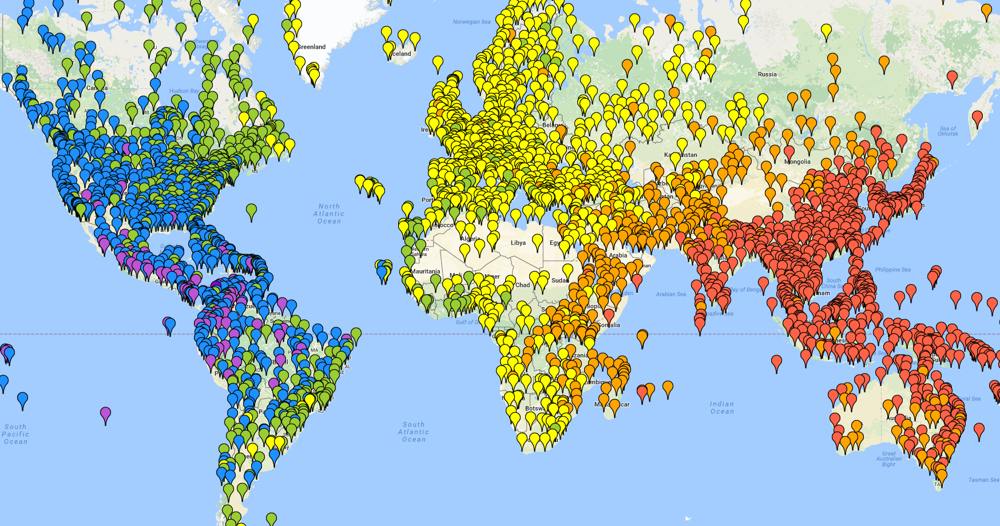

# Transfer Learning for Flight Delay Prediction via Variational Autoencoders

Autoencoding airports via [variational autoencoders](https://jaan.io/what-is-variational-autoencoder-vae-tutorial/) to improve flight delay prediction. Additionally, a principled look at [variational inference](https://www.cs.princeton.edu/courses/archive/fall11/cos597C/lectures/variational-inference-i.pdf) itself and its connections to machine learning.

